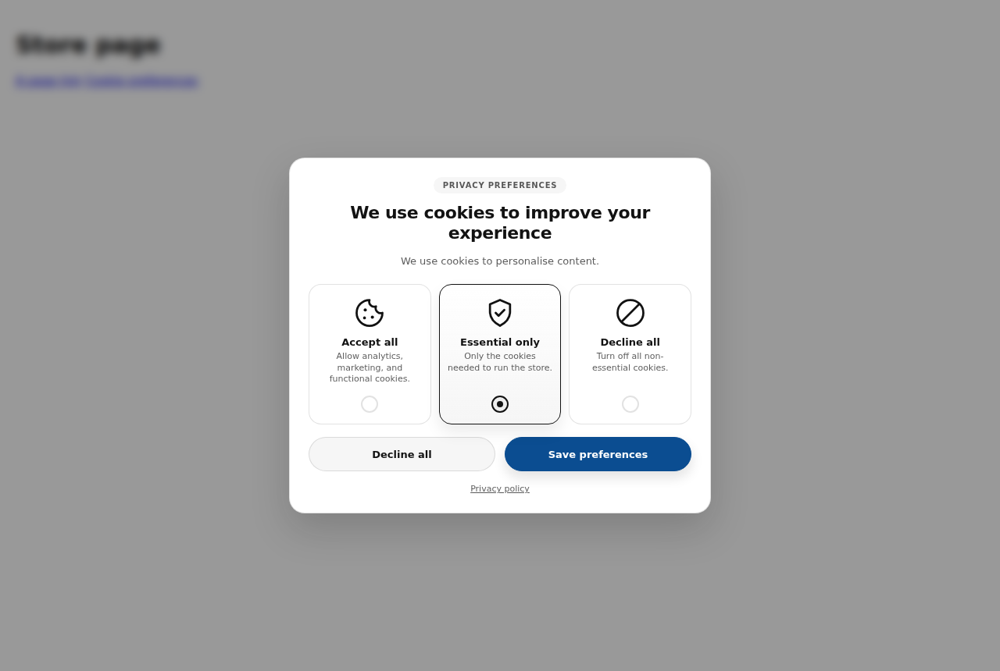
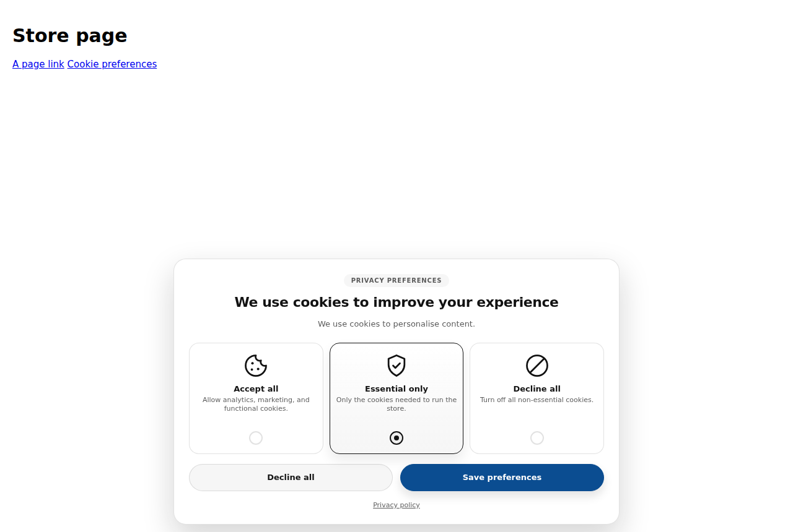
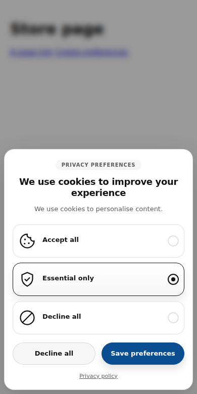
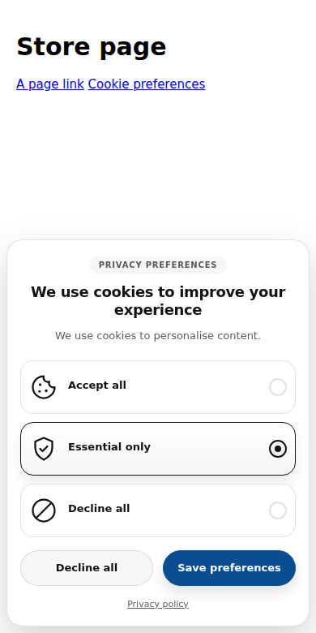

# Cookie consent for Shopify Dawn

A drop-in replacement for an inline cookie-consent popup, rebuilt as a proper
Dawn section: theme-editor settings, Shopify's Customer Privacy API as the
source of truth, and a keyboard-accessible dialog.

| Centred modal | Bottom banner |
| --- | --- |
|  |  |
|  |  |

## Install

1. Copy the files into your theme, keeping the folders:

   | From | To |
   | --- | --- |
   | `assets/cookie-consent.js` | `assets/` |
   | `assets/section-cookie-consent.css` | `assets/` |
   | `snippets/cookie-consent-option.liquid` | `snippets/` |
   | `sections/cookie-consent.liquid` | `sections/` |

2. In `layout/theme.liquid`, render the section just before `</body>`:

   ```liquid
     
   </body>
   ```

3. Delete the old popup — its `<style>`, `<script>` and
   `<div class="custom-cookie-overlay">` block — from wherever it currently
   lives, so the two do not both run.

4. In Shopify admin, go to **Settings → Customer privacy → Cookie banner** and
   choose the regions that must be asked for consent. The section's default
   **Show to → Visitors in regions that require consent** follows that setting.
   Leave Shopify's own banner region config in place; this section hides
   Shopify's banner visually and answers the API on its behalf.

5. Open the theme editor. **Cookie consent** appears at the bottom of the
   section list on every template, and everything below is editable there.

### Reopening the picker

Visitors must be able to change their mind. Any of these opens it again:

- the floating **Cookie preferences** button (**Reopen button** setting),
- any link or button with `href="#cookie-preferences"` — add one to a footer
  menu by pointing a menu item at `https://yourstore.com/#cookie-preferences`,
- any element with a `data-cookie-preferences` attribute,
- `window.cookieConsent.open()` from your own code.

## Settings

| Setting | What it does |
| --- | --- |
| Enable cookie consent | Off falls back to Shopify's built-in banner. |
| Layout | Centred modal, or a bottom banner that does not block the page. |
| Show to | Regions that require consent (recommended), or every visitor. |
| Button shape | Pill, match theme buttons, or square. |
| Color scheme | Any of the theme's schemes. |
| Content | Badge, heading, description, privacy-policy link. |
| Accept all / Essential only / Decline all | Title, description, optional icon per card. |
| Buttons | Decline and save labels, plus the "nothing selected" message. |
| Pre-selected option | Nothing, Essential only (default), or Accept all. |
| Reopen button | Show the floating button and set its label. |

Each card has a built-in SVG icon that inherits the theme's text colour, so no
image uploads are needed. Setting an icon replaces it.

## What each choice sends

Consent is recorded with `Shopify.customerPrivacy.setTrackingConsent`:

| Choice | analytics | marketing | preferences | sale_of_data |
| --- | --- | --- | --- | --- |
| Accept all | ✅ | ✅ | ✅ | ✅ |
| Essential only | ❌ | ❌ | ✅ | ❌ |
| Decline all | ❌ | ❌ | ❌ | ❌ |

"Essential only" keeps *preferences* cookies — language, currency, recently
viewed — because those are what make the storefront work. Strictly necessary
cookies are exempt from consent and are not part of this API.

## Changes from the original popup

**Correctness**

- Shopify's Customer Privacy API is now the source of truth.
  `shouldShowBanner()` decides whether to ask, so the banner respects the
  visitor's region and reappears when consent expires or is withdrawn. The old
  version asked every visitor once and trusted `localStorage` forever, which
  meant expiry and withdrawal were never honoured.
- If the consent API never loads, the banner still works and the choice is kept
  locally, instead of silently doing nothing.
- `localStorage` reads and writes are wrapped in `try`/`catch`; the old version
  threw in Safari private mode and blocked the whole script.
- Visitors who already answered the old banner are migrated, not re-prompted.
- Shopify's native banner is now hidden by JavaScript rather than by a
  stylesheet. If this script is blocked or fails, Shopify's own banner still
  appears — the old CSS hid it unconditionally, so a script error left the store
  with no consent UI at all.
- `.needsclick`, `.cc-window` and `[data-shopify-policy-banner]` are no longer
  force-hidden. `.needsclick` in particular is a React-based class used by
  Klaviyo and other popup apps, and hiding it site-wide breaks them.
- Consent is written once, on save, instead of being re-applied on every load.

**Privacy and compliance**

- "Accept all" is no longer pre-ticked. A pre-ticked consent box is not valid
  consent under the GDPR; the default is now "Essential only", and the merchant
  can choose "nothing pre-selected" instead.
- The meaningless "Cancel" button is now "Decline all", the same size and weight
  as "Save preferences". Making the privacy-friendly option harder to reach than
  the permissive one is a dark pattern regulators act on.
- Global Privacy Control is honoured: a visitor sending GPC starts on the most
  restrictive option, and `sale_of_data` stays off even if they pick
  "Accept all".
- Dismissing the dialog (Escape, or a click outside) grants nothing and the
  banner returns on the next page, rather than counting as an answer.
- A reopen path is provided, which the original had no way to do once Shopify's
  own preferences dialog was hidden.

**Accessibility**

- Real dialog semantics: `role="dialog"`, `aria-modal`, `aria-labelledby`,
  `aria-describedby`, and a labelled `fieldset` around the choices.
- Focus moves into the dialog, is trapped while the modal is open, and returns
  to whatever opened it on close.
- Escape closes the dialog.
- Visible keyboard focus on the cards. The old version hid the radio inputs with
  `opacity: 0` and styled nothing on focus, so keyboard users could not see
  where they were.
- The bottom-banner layout deliberately does *not* trap focus or lock scrolling,
  because it does not cover the page.
- `prefers-reduced-motion` disables the animations.
- Icons are `aria-hidden`; the cards are labelled by their text.

**Performance and theming**

- Three PNG requests replaced by inline SVG.
- CSS and JS are external assets, so they are cached across page loads and no
  longer re-parsed inline on every request.
- Colours, fonts, radii and shadows come from the theme's color scheme
  variables, so the dialog follows the merchant's branding instead of
  hard-coded `#111` and `#0b4d91`.
- Positioning uses flexbox rather than `transform: translate(-50%, -50%)`, which
  the original's open/close animations would have fought with.
- The selected state is mirrored onto a `data-selected` attribute, so styling
  does not depend on `:has()`.
- Scroll lock compensates for the scrollbar width, so the page does not shift
  when the modal opens.
- `backdrop-filter` is behind an `@supports` check with a solid fallback.

## Tests

`test/` runs the real asset files against a stubbed Customer Privacy API in
headless Chromium — 32 checks covering the consent payloads, region gating,
persistence, the focus trap and both layouts. See `test/README.md`.

## Requirements

Dawn 10 or newer (uses `color_scheme` settings and the `--color-foreground`
scheme variables). On older themes, replace the `color_scheme` setting with a
plain `select` and the variables have fallbacks built in.
